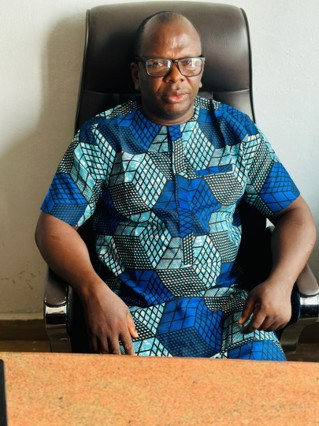

Akowe and Babalaje Egbe Bobaseye Okunrin (Asiwaju), Imota

{fig-align="left"}

Hon. Abass Ayodele Gabriel is a Higher National Diploma (HND) graduate of Lagos State Polytechnic. He is a resilient, dedicated, competent, energetic, and results-oriented professional with extensive experience gained from serving in several reputable multinational companies within the private sector. His commitment to excellence and strong work ethic have distinguished him throughout his career. A respected politician, Hon. Gabriel has earned recognition through his impactful contributions to grassroots governance and public service. His vast political experience and exemplary leadership led to his appointment as the Supervisory Councillor for Budget and Revenue in Imota Local Council Development Area (LCDA), a position he served with distinction from 2017 to 2021. In recognition of his outstanding performance, he was reappointed to the same office for a second term, serving from 2021 to 2025. He currently serves as the Special Adviser on Information and Communication Technology (ICT) to the Executive Chairman of Imota Local Council Development Area (LCDA), where he provides strategic guidance on digital transformation and technology-driven governance. Beyond public service, Hon. Gabriel is the Managing Director and Chief Executive Officer (MD/CEO) of Ibirorun Global Services Nigeria, demonstrating his entrepreneurial acumen and commitment to business development. He is also the Akowe and Babalaje of Egbe Bobaseye Okunrin Asiwaju Imota, where he continues to play a significant role in promoting unity, leadership, and community development.