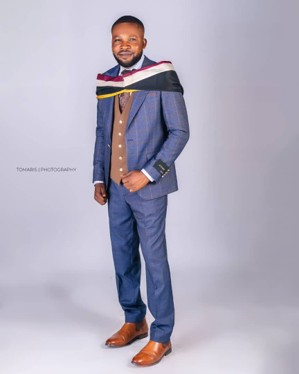

Balogun Egbe Bobaseye Okunrin (Asiwaju), Imota

{fig-align="left"}

Odusanya Ismail is a Chartered Accountant with over two decades of experience, holding professional certifications from both Nigeria and abroad alongside strong academic qualifications. His expertise spans the three core pillars of financial oversight; accounting, audit, and taxation, including independent financial statement reviews and risk-rated assessments across construction, oil and gas, and public-sector subject matter, as well as rules and regulatory standards compliance. This breadth, rather than narrow specialisation, defines his professional strength. Alongside his professional practice, Ismail is currently pursuing postgraduate studies with a focus on financial ethics — reinforcing a career-long conviction that sound financial stewardship is inseparable from questions of integrity and public accountability. In 2004, Ismail joined the Lagos State Local Government Civil Service Commission, where he was deployed to the Imota Local Council Development Area (LCDA). Since then, he has advanced steadily through the ranks to a higher cadre, a progression that reflects sustained competence, reliability, and institutional trust.