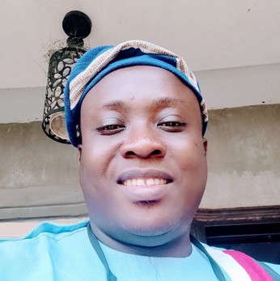

Maiyegun Egbe Bobaseye Okunrin (Asiwaju), Imota

{fig-align="left"}

A Registered Builder and Safety Professional with well over two decades experience in Building and Civil Engineering Construction. Holds an HND in Building Technology, a PGD in Quantity Surveying, and an MSc in Construction Management. Founder of Work Ethics Nigeria Limited, a leading indigenous construction firm renowned for quality delivery, and excellence in project execution. With core expertise in Construction Project mgt, Resource allocation, and On-site supervision Beyond construction, he is a committed community support leader and holds a traditional chieftaincy title of Bashorun in recognition of his service and contributions to community development. Bashorun Ayokanmi Oladunni is fulfilled and happily married
