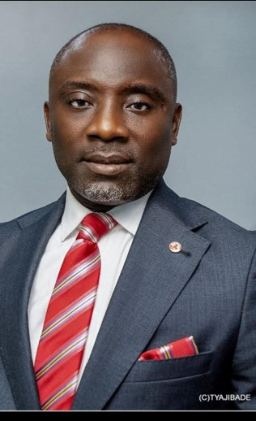

Asoju Egbe Bobaseye Okunrin (Asiwaju), Imota

{fig-align="left"}

Olugbenga Gabriel Salisu is an accomplished financial services professional with over 20 years of experience in Nigeria's financial industry. He has built a strong reputation for strategic leadership, operational excellence, and driving business growth across leading insurance and banking institutions. As Regional Branch Manager at Heirs/UBA, he leads branch performance, retail expansion, agent development, and customer-focused service delivery, contributing significantly to the company's growth and market presence. Before joining Heirs/UBA, Olugbenga held senior roles at Leadway Assurance, AIICO Insurance Plc, Access Bank, and GTBank, where he successfully led sales strategies, managed high-performing teams, and expanded market reach across retail and corporate segments. Passionate about financial inclusion and customer empowerment, he is recognized for building high-performing teams, strengthening branch operations, and mentoring emerging professionals. His collaborative leadership style and commitment to excellence have earned him a reputation as a results-driven transformational leader.
