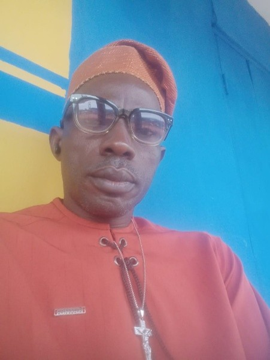

Ashipa Egbe Bobaseye Okunrin (Asiwaju), Imota

{fig-align="left"}

Sesan Adebowale Sigbeku is a seasoned business executive with extensive experience in the commercial printing industry. As the Executive Director of Fimokins Global Concepts, he has successfully positioned the company as a trusted provider of high-quality printing and branding solutions. With expertise spanning large-format printing, corporate branding, packaging, and integrated print solutions, Sesan has built a reputation for delivering exceptional quality, precision, and customer-focused service. His strategic leadership, commitment to operational excellence, and strong client relationships have been instrumental in the company's sustained growth and industry recognition. Driven by innovation and a passion for excellence, he is dedicated to helping businesses transform their brand identity into compelling visual experiences through world-class print solutions. His unwavering commitment to quality, reliability, and continuous improvement continues to set Fimokins Global Concepts apart in a highly competitive marketplace.
