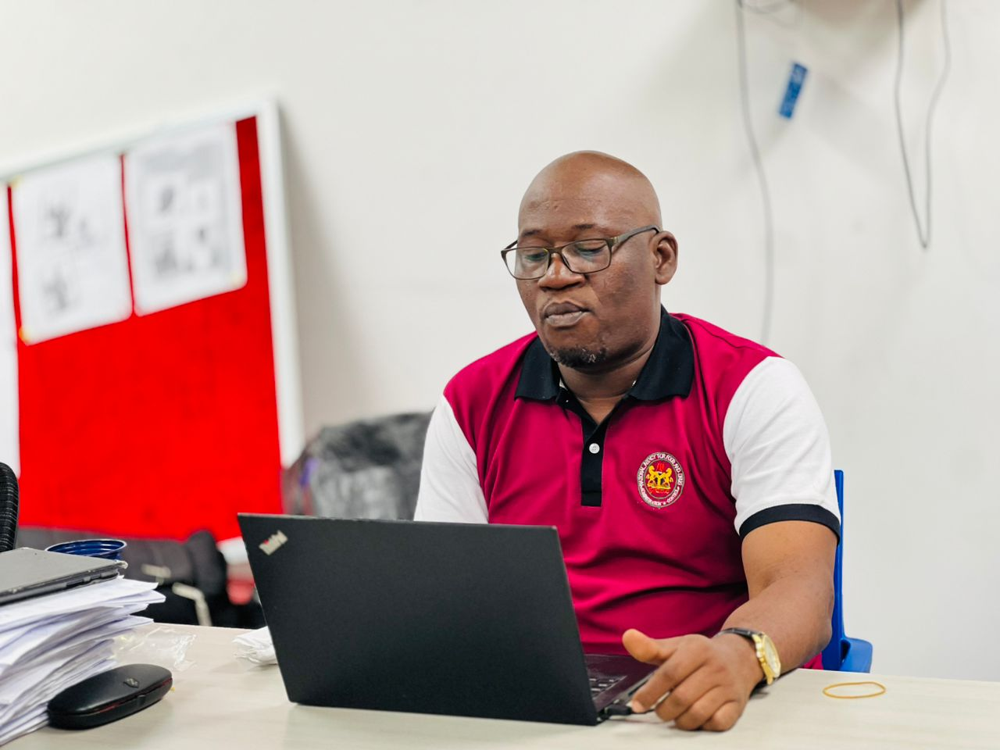

Agba-Akin & Otun-Giwa Egbe Bobaseye Okunrin (Asiwaju) Imota

{fig-align="left" width="1000"}

Agba-Akin is an accomplished Statistician, researcher, data analyst, regulatory professional and community leader with over two decades of experience spanning statistics, public administration, railway operations, pharmaceutical regulation and evidence-based decision-making.

He began his professional development at the Nigerian Railway Traffic Training School, Enugu, where he obtained a Proficiency Certificate in Traffic and Commercial Operations. He later earned a National Diploma in Mathematics and Statistics and a Higher National Diploma in Statistics with Distinction from Kwara State Polytechnic, Ilorin. He proceeded to Ahmadu Bello University, Zaria, for a Postgraduate Diploma in Statistics, and later obtained a B.Sc. in Applied Mathematics with First Class Honours from Bells University of Technology, Ota. He also holds a Master’s degree in Statistics, specialising in Biostatistics, with Distinction, and is currently pursuing a **Ph.D. in Statistics** at the same institution.

Professionally, he has built a significant part of his career with the National Agency for Food and Drug Administration and Control (NAFDAC), where he currently serves as an Assistant Chief Statistical Officer in the Ports Inspection Directorate. His responsibilities include statistical analysis, regulatory intelligence, violation monitoring, surveillance, compliance assessment, risk profiling and preparation of periodic reports to support the interception of non-compliant regulated products and strengthen public-health protection.

Before joining NAFDAC, he worked with the Nigerian Railway Corporation, where he rose to the position of Chief Station Master, gaining valuable experience in operations, logistics, administration and supervision. He also served at the Judicial Service Commission, Owerri, during his National Youth Service, where he contributed to statistical reporting and staff development activities.

Aare Akintunde is an active researcher with interests in biostatistics, public health, machine learning, predictive analytics, pharmaceutical regulation, counterfeit medicines, pharmacovigilance and vaccine hesitancy. He has authored and co-authored several scientific and academic publications on public-health and regulatory issues. Click [here](https://scholar.google.com/citations?user=6Q3wb9UAAAAJ&hl=en) to view his Google Scholar profile.\]

He is a member of the Chartered Institute of Statisticians of Nigeria (CISON), serves as the South-West Coordinator of the International Association for Statistical Computing (IASC), and is the Public Relations Officer of CISON, Lagos State Chapter.

Beyond his professional career, he is deeply involved in community and cultural leadership. He is a foundation member of Egbe Bobaseye Okunrin (Asiwaju), Imota, where he holds the title of Agba-Akin and serves as Otun-Giwa Egbe. He is also the Pioneer and current President of De Royal Ambassadors of Imota.

His career reflects a strong blend of academic excellence, professional competence, research scholarship, leadership and community service. At the heart of his work is a firm belief that data should not merely describe events, but should provide intelligence for understanding problems, predicting risks and guiding better decisions.

For all info about Yusuf Akintuntunde Click [here](Akintunde-cv.pdf){target="_blank"} to view the resume.
