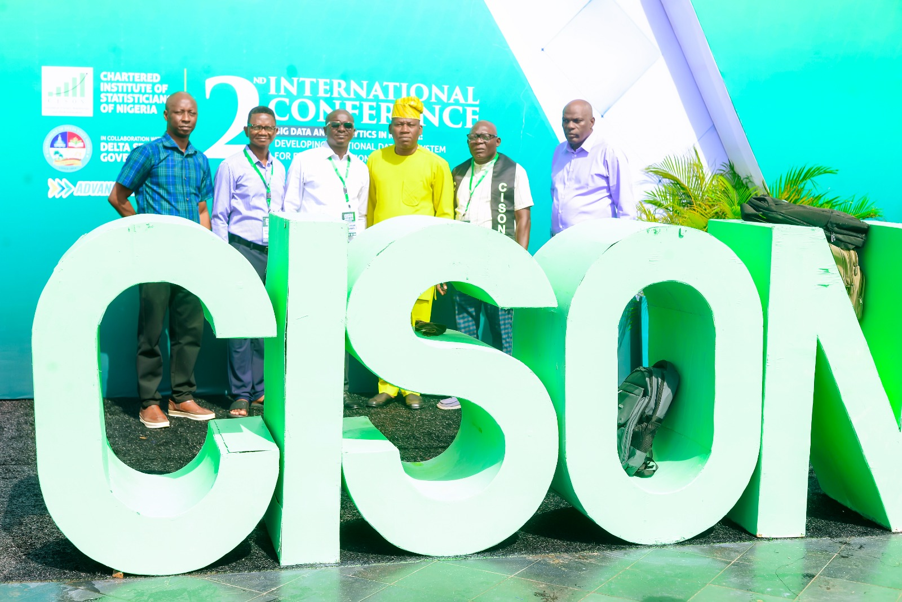
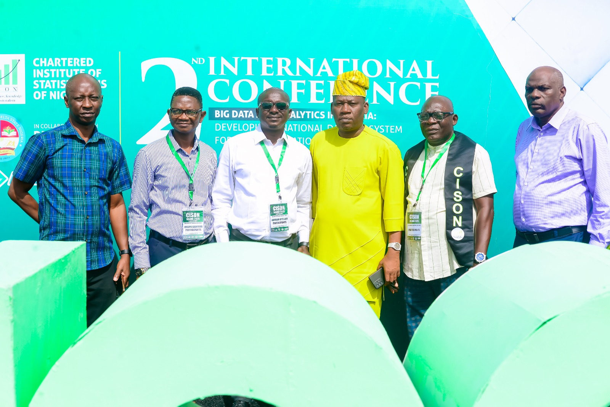
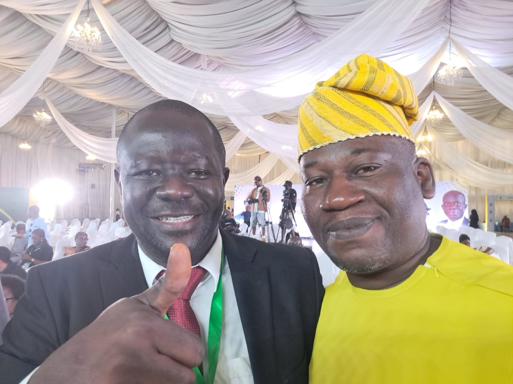
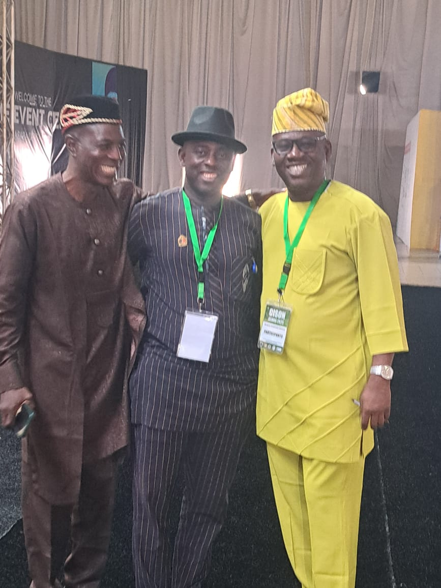
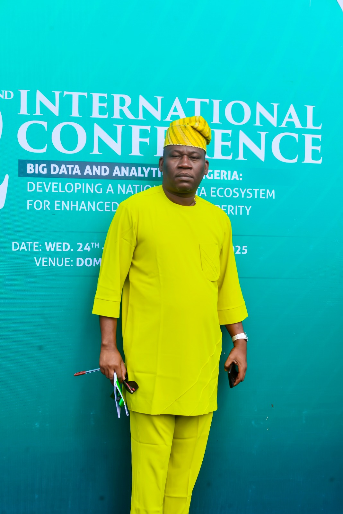

## REPORT ON THE 2ND CISON INTERNATIONAL CONFERENCE AND 49TH ANNUAL CONFERENCE

### Asaba, Delta State \| September 22–26, 2025

The **2nd CISON International Conference and 49th Annual Conference of the Chartered Institute of Statisticians of Nigeria (CISON)** was successfully held from **September 22 to September 26, 2025**, at the **Dome Event Centre, Asaba, Delta State**.

The conference was preceded by a highly relevant pre-conference programme titled **“Big Data Analytics and Machine Learning: Methods and Applications.”** The session provided participants with practical and conceptual insights into contemporary analytical methods, machine-learning techniques, and their applications across research, public administration, business, regulation, and national development. It served as an appropriate foundation for the main conference discussions and reflected the growing importance of advanced analytics in modern statistical practice.

As both a participant and reporter at the conference, I found the gathering highly significant, intellectually stimulating, and professionally rewarding. It brought together statisticians, researchers, academics, policymakers, government officials, data professionals, students, and other stakeholders from across Nigeria and beyond to deliberate on the expanding role of data and analytics in national development.

The conference, themed **“Big Data and Analytics in Nigeria: Developing a National Data Ecosystem for Enhanced National Prosperity,”** provided a timely platform for discussing how Nigeria can strengthen its statistical and data infrastructure to support evidence-based policymaking, development planning, economic management, institutional effectiveness, and sustainable national prosperity.

A notable feature of the conference was the participation of a delegation from the **National Agency for Food and Drug Administration and Control (NAFDAC)**. The Agency was represented by **myself, Aare Yusuf Akintunde Azeez, from Lagos; Mrs. Alegbe; Mr. Felix Temange; Hajia Mariam; and Mr. Mujaya from Abuja**. Our participation provided an opportunity to engage with emerging developments in statistics, data analytics, and machine learning, while also interacting with professionals from academia, government institutions, regulatory agencies, and the private sector. The conference was particularly relevant to NAFDAC’s increasing reliance on data-driven approaches to research, surveillance, regulatory intelligence, monitoring, and decision-making.

{fig-align="center"}

The conference featured several activities beyond formal paper presentations and technical sessions. There were professional engagements, interactive discussions, networking sessions, knowledge-sharing opportunities, and social activities that enabled participants to reconnect, exchange ideas, and strengthen professional relationships. These activities contributed significantly to the success of the conference and created an atmosphere of intellectual engagement and professional fellowship.

The **Lagos State Chapter of CISON** was also prominently represented throughout the conference. Members actively participated in the various technical and social activities, reflecting the Chapter’s commitment to the advancement of the statistical profession. Several photographs were taken by members of the Lagos Chapter to document memorable moments, professional interactions, and the collective participation of members during the conference.

Another important aspect of the gathering was the presence of **many distinguished professors, senior academics, researchers, and experienced practitioners** from various universities and institutions. Their participation added considerable intellectual depth to the proceedings. The interaction between senior scholars and younger professionals provided opportunities for mentoring, knowledge exchange, collaboration, and exposure to emerging statistical ideas and research methodologies.

One of the strongest messages from the conference was that **Nigeria’s development aspirations cannot be effectively achieved without credible, timely, accessible, and properly coordinated data**. In an era in which data has become a strategic national resource, the quality of decisions made by governments, businesses, regulatory institutions, and development organisations increasingly depends on the quality and reliability of available information.

The Executive Governor of Delta State, **Rt. Hon. Sheriff Oborevwori**, as host of the conference, emphasised the importance of developing a robust national data infrastructure capable of supporting effective governance and national development. His message reinforced the need for governments at all levels to recognise statistics not merely as an administrative exercise but as a critical instrument for planning, resource allocation, performance measurement, accountability, and policy formulation.

{fig-align="center"}

The conference also featured important contributions from the President of the Chartered Institute of Statisticians of Nigeria, **Dr. Ebuh Godday**, who highlighted the professional responsibilities of statisticians in strengthening Nigeria’s evolving data ecosystem. His address underscored the importance of professional competence, ethical statistical practice, capacity development, and the greater utilisation of statistical evidence in both public and private sector decision-making.

Also prominent was the participation of the **Statistician-General of the Federation, Prince Adeyemi Adeniran**, whose presence further demonstrated the central role of official statistics in national planning and development. Contributions from representatives of institutions including the **Central Bank of Nigeria** and the **Federal Ministry of Education** broadened the discourse and demonstrated the relevance of data and analytics across virtually every sector of national life.

{fig-align="center"}

Throughout the conference, discussions focused on the opportunities presented by **big data, data analytics, artificial intelligence, machine learning, and modern statistical techniques**, while also recognising significant challenges such as data fragmentation, inadequate infrastructure, capacity gaps, inconsistent data standards, limited institutional collaboration, and the need for stronger data governance frameworks.

As a practising Statistician, the conference was particularly enriching. It provided an opportunity not only to listen to leading professionals, professors, policymakers, and researchers, but also to interact with colleagues, exchange ideas, establish professional contacts, and reflect on the changing responsibilities of statisticians in an increasingly data-driven world.

One major takeaway for me was that the future of Statistics extends far beyond the traditional collection, tabulation, and presentation of figures. The modern Statistician must increasingly possess the capacity to **transform large and complex datasets into actionable intelligence, identify patterns and risks, apply machine-learning and analytical techniques, communicate findings effectively, and provide evidence that can guide policy and strategic decisions**.

The conference equally highlighted the need for stronger collaboration among the **National Bureau of Statistics, government ministries and agencies, regulatory institutions, universities, research organisations, professional bodies, private-sector organisations, and technology companies**. A functional national data ecosystem cannot thrive where institutions operate in isolation. Data must be integrated, harmonised, properly governed, and utilised in a manner that promotes quality, accessibility, security, interoperability, and responsible use.

{fig-align="center"}

The five-day gathering in Asaba was therefore more than an annual professional conference. It represented an important national conversation about the future of Nigeria’s data architecture and the responsibility of statisticians in shaping that future. It was equally a celebration of professional fellowship, academic excellence, research, innovation, and the growing relevance of Statistics in national development.

For me as a participant and member of the NAFDAC delegation, the experience further strengthened my conviction that **data must move from the background of institutional and national decision-making to the centre of policy, planning, regulation, and development**. Nigeria possesses enormous volumes of administrative, economic, health, educational, regulatory, demographic, and commercial data. The major task before us is to transform these scattered data resources into reliable knowledge capable of improving governance, institutional performance, and the lives of citizens.

The **2nd CISON International Conference and 49th Annual Conference** ultimately provided an excellent platform for professional networking, intellectual engagement, academic interaction, institutional collaboration, capacity development, and renewed advocacy for a stronger national statistical system.

As Nigeria advances further into the era of **Big Data, Artificial Intelligence, Machine Learning, and digital transformation**, the message from Asaba remains both timely and compelling: **a nation that seeks sustainable prosperity must first understand itself through credible data.**

The responsibility therefore rests on statisticians, researchers, academics, regulators, policymakers, and institutions to build a national data ecosystem in which evidence becomes the foundation of planning, regulation, innovation, and development rather than an afterthought.

**Reported by:**\
**Aare Yusuf Akintunde Azeez**\
*Statistician \| Data Analyst \| Researcher*\
*NAFDAC Representative and Participant*\
*2nd CISON International Conference & 49th Annual Conference*\
**Asaba, Delta State — September 2025**
