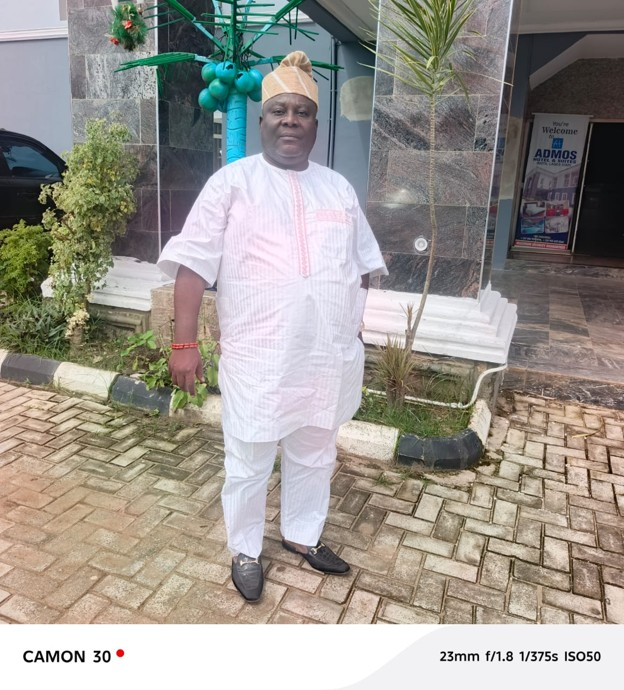
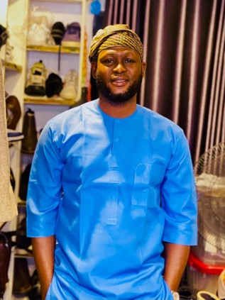
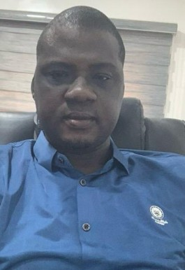
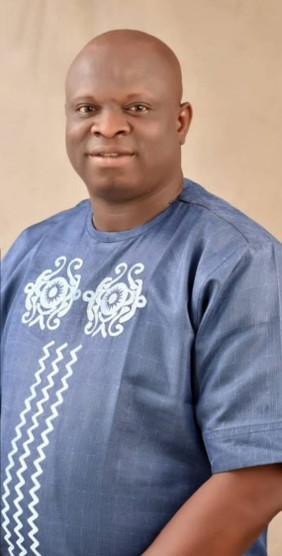
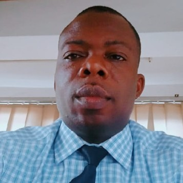

## EGBE BOBASEYE OKUNRIN (ASIWAJU), IMOTA

**Egbe Bobaseye Okunrin (Asiwaju), Imota** is a traditional age-grade association, a form of socio-cultural grouping commonly found within Ijebu communities and other parts of Western Nigeria. Such groups play important roles in promoting communal unity, preserving cultural values, encouraging social responsibility, and contributing to the development of their communities.

The association comprises men within a defined age bracket, generally spanning about three years. As the name suggests, **Bobaseye Okunrin** is principally a male group made up of individuals who have attained a reasonable level of social standing, financial responsibility, maturity, and community relevance.

The group places strong emphasis on **integrity, dignity, unity, responsibility, and respect for tradition**. Its royal identity and outlook reflect its close association with the traditional institution of Imota. The association enjoys the endorsement of **His Royal Majesty, Oba Mudashiru Ajibade Bakare Agoro, Olufoworesete II, the Ranodu of Imota**.

{fig-alt="Ranodu of Imota"}

Since 2024, **Egbe Bobaseye Okunrin (Asiwaju), Imota** has actively participated in the annual **Ayayo Day Celebration**, where the group has continued to distinguish itself through organisation, unity, cultural display, and active community participation.

In recognition of leadership, experience, and community standing, the association appointed **Aremo Tajudeen Adekoya, the Aremo Oyemade and Chairman of Admos Hotels and Suites**, as its **Baba Egbe**.

The group is presently led by a team of committed officers, including **Mr. Mobolaji Ogunbowale, Giwa Egbe; Mr. Yusuf Akintunde Azeez, Otun-Giwa Egbe; and Mr. Ayodele Gabriel, Akowe Egbe**, alongside other dedicated members who contribute to the growth and smooth administration of the association.

One of the association’s important traditions is its **monthly rotational hosting system**, whereby members take turns to host the group. This arrangement promotes fellowship, strengthens relationships among members, and provides a regular platform for deliberation on matters affecting the association and the wider Imota community. The most recent edition was hosted by **Otun-Giwa, Agba-Akin Yusuf Akintunde Azeez**.

With the **2026 Ayayo Day Celebration just five days away**, Egbe Bobaseye Okunrin (Asiwaju), Imota is fully prepared to make another strong and memorable appearance at the event. The group remains determined to uphold its reputation for excellence, unity, cultural pride, and distinguished participation.

As Ayayo Day approaches, the association looks forward to once again celebrating the **heritage, identity, culture, and collective spirit of Imota**, while continuing to stand proudly among the leading socio-cultural groups contributing to the progress and preservation of the town’s traditions.

## MEMBERS PROFILE

### Ogunbowale Mobolaji

The Giwa and Baamofin Egbe Bobaseye Okunrin (Asiwaju), Imota

{fig-align="left"}

**Mobolaji Ogunbowale** is a distinguished legal practitioner and a **Barrister and Solicitor of the Supreme Court of Nigeria**. He is the **Founder and Principal Partner of M.O. Legal**, a commercial and litigation law firm providing professional legal services across a broad range of practice areas.

An indigene of **Imota, Lagos State**, Mr. Ogunbowale obtained his **Bachelor of Laws (LL.B. Hons.)** from **Lagos State University, Ojo, Lagos State**. He subsequently attended the **Nigerian Law School, Abuja**, and was called to the **Nigerian Bar in 2007**.

He is a member of the **Nigerian Bar Association (NBA)** and the **Nigerian Institute of Chartered Arbitrators (NICArb)**, and is also an **Associate Member of the Chartered Institute of Taxation of Nigeria (CITN)**.

Over the course of his legal career, Mr. Ogunbowale has developed considerable expertise in **commercial and property litigation, debt recovery, corporate law, taxation law, labour and employment law, and arbitration**.

Through his professional practice, he has continued to demonstrate a strong commitment to legal excellence, integrity, effective advocacy, and the delivery of practical solutions to complex legal and commercial matters.

### Yusuf Akintunde Azeez

Otun-Giwa and Agba-Akin Egbe Bobaseye Okunrin (Asiwaju), Imota

{fig-align="left"}

Akintunde is a First-Class graduate and accomplished Statistician with strong experience in pharmaceutical regulation, research, biostatistics, and data analytics. He holds an M.Sc. in Statistics (Biostatistics) from Bells University of Technology, Ota, and is currently pursuing a Ph.D. in Statistics.

His expertise includes electronic data capture, statistical analysis, data science, pharmacovigilance, predictive analytics, and data visualization, with proficiency in tools such as R, SPSS, and Minitab.

He currently serves as a **Violation Monitoring Officer** in the Intelligence, Monitoring and Risk Unit of **NAFDAC**, where he contributes to regulatory intelligence, surveillance, compliance monitoring, and risk management.

He is also the Founder and CEO of **Adept Data Solution (ADS)**, providing statistical and data science solutions to researchers, businesses, government agencies, and development organisations.

Within the professional community, he serves as **South-West Coordinator of the International Association for Statistical Computing (IASC)** and **Public Relations Officer of the Chartered Institute of Statisticians of Nigeria (CISON), Lagos State Chapter**, promoting professional development, research collaboration, and data-driven decision-making.

### Abass Ayodele Gabriel

Akowe and Babalaje Egbe Bobaseye Okunrin (Asiwaju), Imota

{fig-align="left"}

Hon. Abass Ayodele Gabriel is a Higher National Diploma (HND) graduate of Lagos State Polytechnic. He is a resilient, dedicated, competent, energetic, and results-oriented professional with extensive experience gained from serving in several reputable multinational companies within the private sector. His commitment to excellence and strong work ethic have distinguished him throughout his career. A respected politician, Hon. Gabriel has earned recognition through his impactful contributions to grassroots governance and public service. His vast political experience and exemplary leadership led to his appointment as the Supervisory Councillor for Budget and Revenue in Imota Local Council Development Area (LCDA), a position he served with distinction from 2017 to 2021. In recognition of his outstanding performance, he was reappointed to the same office for a second term, serving from 2021 to 2025. He currently serves as the Special Adviser on Information and Communication Technology (ICT) to the Executive Chairman of Imota Local Council Development Area (LCDA), where he provides strategic guidance on digital transformation and technology-driven governance. Beyond public service, Hon. Gabriel is the Managing Director and Chief Executive Officer (MD/CEO) of Ibirorun Global Services Nigeria, demonstrating his entrepreneurial acumen and commitment to business development. He is also the Akowe and Babalaje of Egbe Bobaseye Okunrin Asiwaju Imota, where he continues to play a significant role in promoting unity, leadership, and community development.

### BadejO Adejuwon Ogodo

Ashiwaju Egbe Bobaseye Okunrin (Asiwaju), Imota

{fig-align="left"}

Badejo Adejuwon Ogbodo is a political scientist and seasoned public service professional with over a decade of experience in tourism administration and public sector management. He joined the Lagos State Civil Service in 2010 and was deployed to the then Lagos State Ministry of Tourism and Intergovernmental Relations, now the Lagos State Ministry of Tourism, Arts and Culture. In 2011, he was appointed Personal Assistant to the then Honourable Commissioner for Tourism, Mr. Disun Holloway, where he contributed to the implementation of key initiatives that advanced the state's tourism agenda. In recognition of his dedication, professionalism, and outstanding service, he was promoted to the position of Chief Tourism Officer in 2025, becoming the first public officer from the Ikorodu Division to attain this designation in the Lagos State Public Service. His career reflects a strong commitment to promoting tourism, preserving cultural heritage, and advancing excellence in public administration.

### Alhaji Alimi Kabiru

Seriki Egbe Bobaseye Okunrin (Asiwaju), Imota

{fig-align="left"}

Comrade (Alhaji) Alimi Kabiru Oluwatobi is a dedicated public servant, labour leader, and entrepreneur with an unwavering commitment to service, leadership, and community development. He currently serves as a mid-level officer in the Lagos State Local Government Service Commission, having joined the public service in 2007. He began his career with Imota Local Council Development Area (LCDA) before being deployed to Ikosi-Isheri LCDA in Kosofe Local Government Area of Lagos State, where he has continued to distinguish himself through diligence, professionalism, and exemplary service. Driven by a passion for advocating for the welfare and rights of workers, Comrade Alimi became actively involved in trade union activities from the onset of his public service career. His dedication and commitment to the cause of workers earned him the confidence of his colleagues, culminating in his emergence as the Chairman of the Nigeria Union of Local Government Employees (NULGE) in his Local Government. Beyond public service, he is the Chief Executive Officer of Kaybee Global Standard Enterprises, a Corporate Affairs Commission (CAC)-registered company with over two decades of experience in the construction industry. The firm specializes in building construction consultancy, project supervision, general contracting, the production of high-quality building blocks, and the supply of a wide range of building materials.

In addition to his expertise in construction, Comrade Alimi is actively involved in livestock production and supply, with specialization in cattle, rams, and goats, reflecting his entrepreneurial versatility and commitment to contributing to Nigeria's agricultural sector. Outside his professional and business engagements, he enjoys meaningful conversations on personal development, leadership, and societal progress. He values strong relationships with family and friends and is passionate about initiatives that promote growth, unity, and community advancement.

### Oyebanjo Salaudeen Oluwatosin

Bashorun Egbe Bobaseye Okunrin (Asiwaju), Imota

{fig-align="left"}

ESV. Oyebanjo Salaudeen Oluwatosin is a registered Estate Surveyor and Valuer, Licensed Auctioneer, and an accomplished real estate professional with expertise in property valuation, land administration, and urban development. A native of Imota in the Ikorodu area of Lagos State, he holds a Master's degree in Urban Development and is a member of several professional bodies, including the Nigerian Institution of Estate Surveyors and Valuers (NIESV) and the Nigerian Institute of Management (MNIM). Before joining the Lagos State Government in 2023 as a Senior Land Officer, he built a successful career in the private sector, providing consultancy services in estate surveying, valuation, and real estate practice. His professional experience spans property valuation, advisory services, and land management. Outside his professional responsibilities, ESV. Oyebanjo enjoys reading and participating in sporting activities. He is happily married and blessed with children.

### Odusanya Ismail

Balogun Egbe Bobaseye Okunrin (Asiwaju), Imota

{fig-align="left"}

Odusanya Ismail is a Chartered Accountant with over two decades of experience, holding professional certifications from both Nigeria and abroad alongside strong academic qualifications. His expertise spans the three core pillars of financial oversight; accounting, audit, and taxation, including independent financial statement reviews and risk-rated assessments across construction, oil and gas, and public-sector subject matter, as well as rules and regulatory standards compliance. This breadth, rather than narrow specialisation, defines his professional strength. Alongside his professional practice, Ismail is currently pursuing postgraduate studies with a focus on financial ethics — reinforcing a career-long conviction that sound financial stewardship is inseparable from questions of integrity and public accountability. In 2004, Ismail joined the Lagos State Local Government Civil Service Commission, where he was deployed to the Imota Local Council Development Area (LCDA). Since then, he has advanced steadily through the ranks to a higher cadre, a progression that reflects sustained competence, reliability, and institutional trust.

### Chief Oguntola Abayomi

Otunba Egbe Bobaseye Okunrin (Asiwaju), Imota

{fig-align="left"}

The managing director/ Chief Executive Officer of DETITAAB MULTIBIZ SERVICES LIMITED. A Realtor with a vast knowledge in properties development/ Estate management, consultant in freight Logistics and also a consultant in conflict management. This Establishment has been in existence over a decade and its well manager under my supervision. A well-rooted society service provider through an international charity organization known as Lions club international (LCI). An officer of the Law with the rank of Assistant Superintendent of Police (SPY). Happily married with Children.

### Oladega Musbau Lawrence

Tunwase Egbe Bobaseye Okunrin (Asiwaju), Imota

{fig-align="left"}

Oladega M. Lawrence is an accomplished entrepreneur, project management professional, and real estate practitioner with extensive experience in business development, property investment, land documentation, and strategic partnerships.

He is the Founder and Chief Executive Officer of Bauglobal Resources Ltd., a real estate company focused on land acquisition, property development, documentation, investment advisory, and innovative real estate solutions.

### Bldr. Ayokanmi Oladunni

Maiyegun Egbe Bobaseye Okunrin (Asiwaju), Imota

{fig-align="left"}

A Registered Builder and Safety Professional with well over two decades experience in Building and Civil Engineering Construction. Holds an HND in Building Technology, a PGD in Quantity Surveying, and an MSc in Construction Management. Founder of Work Ethics Nigeria Limited, a leading indigenous construction firm renowned for quality delivery, and excellence in project execution. With core expertise in Construction Project mgt, Resource allocation, and On-site supervision Beyond construction, he is a committed community support leader and holds a traditional chieftaincy title of Bashorun in recognition of his service and contributions to community development. Bashorun Ayokanmi Oladunni is fulfilled and happily married

### Salisu Olugbenga Gabriel

Asoju Egbe Bobaseye Okunrin (Asiwaju), Imota

{fig-align="left"}

Olugbenga Gabriel Salisu is an accomplished financial services professional with over 20 years of experience in Nigeria's financial industry. He has built a strong reputation for strategic leadership, operational excellence, and driving business growth across leading insurance and banking institutions. As Regional Branch Manager at Heirs/UBA, he leads branch performance, retail expansion, agent development, and customer-focused service delivery, contributing significantly to the company's growth and market presence. Before joining Heirs/UBA, Olugbenga held senior roles at Leadway Assurance, AIICO Insurance Plc, Access Bank, and GTBank, where he successfully led sales strategies, managed high-performing teams, and expanded market reach across retail and corporate segments. Passionate about financial inclusion and customer empowerment, he is recognized for building high-performing teams, strengthening branch operations, and mentoring emerging professionals. His collaborative leadership style and commitment to excellence have earned him a reputation as a results-driven transformational leader.

### Sigbeku Sesan Adebowale

Ashipa Egbe Bobaseye Okunrin (Asiwaju), Imota

{fig-align="left"}

Sesan Adebowale Sigbeku is a seasoned business executive with extensive experience in the commercial printing industry. As the Executive Director of Fimokins Global Concepts, he has successfully positioned the company as a trusted provider of high-quality printing and branding solutions. With expertise spanning large-format printing, corporate branding, packaging, and integrated print solutions, Sesan has built a reputation for delivering exceptional quality, precision, and customer-focused service. His strategic leadership, commitment to operational excellence, and strong client relationships have been instrumental in the company's sustained growth and industry recognition. Driven by innovation and a passion for excellence, he is dedicated to helping businesses transform their brand identity into compelling visual experiences through world-class print solutions. His unwavering commitment to quality, reliability, and continuous improvement continues to set Fimokins Global Concepts apart in a highly competitive marketplace.
